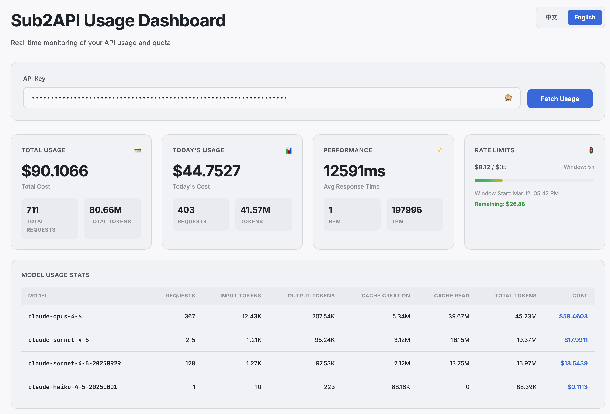

# Sub2API Dashboard

<div align="center">


A lightweight, self-hosted dashboard for monitoring Sub2API usage and statistics.

[English](README.md) | [简体中文](README_zh-CN.md)

</div>

---

## ✨ Features

- 📊 **Real-time Usage Monitoring** - Track API usage, costs, and token consumption
- 💳 **Comprehensive Metrics** - View total and daily usage statistics
- ⚡ **Performance Insights** - Monitor response times, RPM, and TPM
- 🚦 **Rate Limit Visualization** - Visual progress bars for rate limits
- 📈 **Model Statistics** - Detailed breakdown by model with token and cost tracking
- 🔐 **Session Persistence** - Auto-save API keys across page refreshes
- 🎨 **Modern UI** - Clean, responsive design with OKLCH color space
- 🌐 **Bilingual Interface** - English and Chinese support, auto-detects browser language
- 🐳 **Docker Ready** - Single environment variable, easy deployment

## 📸 Screenshots

<div align="center">



</div>

## 🚀 Quick Start

### Prerequisites

- Docker installed on your system
- A valid Sub2API domain (e.g., `https://your-sub2api-domain.com`)

### Run with Docker

```bash
# Set your Sub2API domain
export API_BASE_URL=https://your-sub2api-domain.com

docker run -d \
  -p 11080:11080 \
  -e API_BASE_URL=${API_BASE_URL} \
  --name sub2api-key-dashboard \
  rysinal86/sub2api-key-dashboard
```

Then open your browser and navigate to `http://localhost:11080`

## 📦 Local Build & Install

### Option 1: Docker

1. **Clone the repository**

```bash
git clone https://github.com/rysinal86/sub2api-key-dashboard.git
cd sub2api-key-dashboard
```

2. **Build the Docker image**

```bash
docker build -t sub2api-key-dashboard .
```

3. **Run the container**

```bash
# Set your Sub2API domain
export API_BASE_URL=https://your-sub2api-domain.com

docker run -d \
  -p 11080:11080 \
  -e API_BASE_URL=${API_BASE_URL} \
  --name sub2api-key-dashboard \
  sub2api-key-dashboard
```

### Option 2: Docker Compose

A `docker-compose.yml` is included in the repository. Just clone and start:

1. **Clone the repository**

```bash
git clone https://github.com/rysinal86/sub2api-key-dashboard.git
cd sub2api-key-dashboard
```

2. **Set your Sub2API domain and start**

```bash
# Set your Sub2API domain (required)
export API_BASE_URL=https://your-sub2api-domain.com

docker-compose up -d
```

> **Note:** `API_BASE_URL` must be set before running `docker-compose up`. The compose file reads it from your environment automatically.

## ⚙️ Configuration

### Environment Variables

| Variable | Description | Required |
|----------|-------------|----------|
| `API_BASE_URL` | Full URL of your Sub2API domain (e.g., `https://your-sub2api-domain.com`) | ✅ Yes |

### Port Configuration

By default, the dashboard runs on port `11080`. You can change this by modifying the port mapping:

```bash
docker run -d -p 8080:11080 ...  # Run on port 8080 instead
```

## 📖 Usage

1. Open the dashboard in your browser
2. Enter your API key in the input field
3. Click "Fetch Usage" or press Enter
4. View your usage statistics and metrics

The API key is automatically saved in session storage and will persist across page refreshes (within the same browser session).

## 🛠️ Tech Stack

- **Frontend**: Pure HTML, CSS, JavaScript (no framework dependencies)
- **Server**: Nginx (Alpine Linux)
- **Containerization**: Docker
- **Design**: OKLCH color space, responsive layout

## 🌐 Browser Support

- Chrome/Edge 90+
- Firefox 88+
- Safari 14.1+

## 📄 License

This project is licensed under the MIT License - see the [LICENSE](LICENSE) file for details.

## 🤝 Contributing

Contributions are welcome! Please feel free to submit a Pull Request.

1. Fork the repository
2. Create your feature branch (`git checkout -b feature/AmazingFeature`)
3. Commit your changes (`git commit -m 'Add some AmazingFeature'`)
4. Push to the branch (`git push origin feature/AmazingFeature`)
5. Open a Pull Request

## 📮 Support

If you have any questions or issues, please open an issue on GitHub.

## ⭐ Star History

If you find this project useful, please consider giving it a star!

---

<div align="center">
Made with ❤️ by the community
</div>
