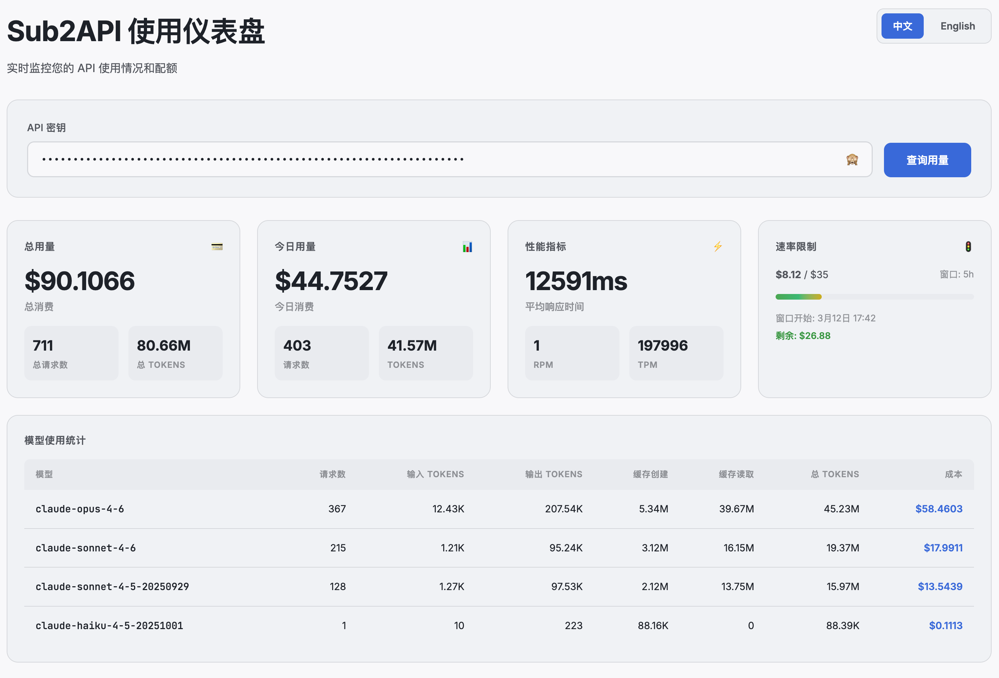

# Sub2API Dashboard

<div align="center">


一个轻量级、自托管的 Sub2API 用量监控与统计仪表板。

[English](README.md) | [简体中文](README_zh-CN.md)

</div>

---

## ✨ 功能特性

- 📊 **实时用量监控** - 跟踪 API 用量、费用和 Token 消耗
- 💳 **全面统计指标** - 查看总用量和每日用量统计
- ⚡ **性能洞察** - 监控响应时间、RPM 和 TPM
- 🚦 **速率限制可视化** - 速率限制的可视化进度条展示
- 📈 **模型统计** - 按模型细分的 Token 和费用详细统计
- 🔐 **会话持久化** - 跨页面刷新自动保存 API Key
- 🎨 **现代化 UI** - 基于 OKLCH 色彩空间的简洁响应式设计
- 🌐 **中英双语界面** - 支持中文和英文，自动识别浏览器语言，手动切换优先
- 🐳 **Docker 就绪** - 仅需一个环境变量，轻松部署

## 📸 截图预览

<div align="center">



</div>

## 🚀 快速开始

### 前置条件

- 系统已安装 Docker
- 有效的 Sub2API Key

### Docker 运行

```bash
docker run -d \
  -p 11080:11080 \
  -e API_BASE_URL=https://your-api-domain.com \
  --name sub2api-key-dashboard \
  rysinal86/sub2api-key-dashboard
```

然后打开浏览器，访问 `http://localhost:11080`

## 📦 安装

### 方式一：Docker（推荐）

1. **克隆仓库**

```bash
git clone https://github.com/rysinal86/sub2api-key-dashboard.git
cd sub2api-key-dashboard
```

2. **构建 Docker 镜像**

```bash
docker build -t rysinal86/sub2api-key-dashboard .
```

3. **运行容器**

```bash
docker run -d \
  -p 11080:11080 \
  -e API_BASE_URL=https://your-api-domain.com \
  --name sub2api-key-dashboard \
  rysinal86/sub2api-key-dashboard
```

### 方式二：Docker Compose

1. **创建 `docker-compose.yml` 文件**

```yaml
version: '3.8'

services:
  sub2api-key-dashboard:
    build: .
    ports:
      - "11080:11080"
    environment:
      - API_BASE_URL=https://your-api-domain.com
    restart: unless-stopped
```

2. **启动服务**

```bash
docker-compose up -d
```

## ⚙️ 配置

### 环境变量

| 变量 | 说明 | 是否必填 |
|------|------|----------|
| `API_BASE_URL` | API 端点的完整 URL（例如 `https://api.example.com`） | ✅ 必填 |

### 端口配置

默认情况下，仪表板运行在 `11080` 端口。可通过修改端口映射来更改：

```bash
docker run -d -p 8080:11080 ...  # 改为在 8080 端口运行
```

## 📖 使用方法

1. 在浏览器中打开仪表板
2. 在输入框中填入您的 API Key
3. 点击「查询用量」或按 Enter 键
4. 查看用量统计和各项指标

API Key 会自动保存在会话存储中，在同一浏览器会话内跨页面刷新后仍可保留。

## 🛠️ 技术栈

- **前端**：纯 HTML、CSS、JavaScript（无框架依赖）
- **服务器**：Nginx（Alpine Linux）
- **容器化**：Docker
- **设计**：OKLCH 色彩空间，响应式布局

## 🌐 浏览器支持

- Chrome/Edge 90+
- Firefox 88+
- Safari 14.1+

## 📄 开源协议

本项目基于 MIT 协议开源，详情请查看 [LICENSE](LICENSE) 文件。

## 🤝 贡献

欢迎贡献代码！请随时提交 Pull Request。

1. Fork 本仓库
2. 创建您的功能分支（`git checkout -b feature/AmazingFeature`）
3. 提交您的更改（`git commit -m 'Add some AmazingFeature'`）
4. 推送到分支（`git push origin feature/AmazingFeature`）
5. 发起 Pull Request

## 📮 支持

如有任何问题，请在 GitHub 上提交 Issue。

## ⭐ Star 历史

如果您觉得本项目有用，欢迎点个 Star 支持！

---

<div align="center">
Made with ❤️ by the community
</div>
